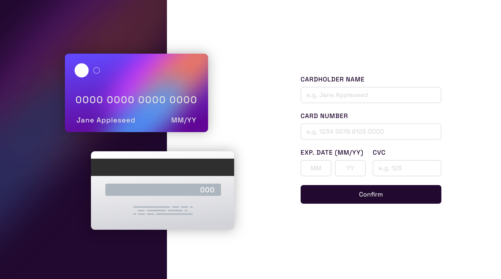

# Frontend Mentor - Interactive card details form solution

This is a solution to the [Interactive card details form challenge on Frontend Mentor](https://www.frontendmentor.io/challenges/interactive-card-details-form-XpS8cKZDWw). Frontend Mentor challenges help you improve your coding skills by building realistic projects.

## Table of contents

-  [Overview](#overview)
   -  [Screenshot](#screenshot)
   -  [Links](#links)
   -  [Built with](#built-with)
   -  [What I learned](#what-i-learned)

## Overview

First project using JavaScript

### Screenshot

### Links

-  Live Site URL: https://telemoca.github.io/card-design-interactive/

### Built with

-  HTML5
-  CSS custom properties
-  CSS pseudo-classes and pseudo-elements
-  CSS media-queries
-  Flexbox
-  JavaScript

### What I learned

I learned to use JS in real projects, using RegEx to filter which caracters can be used in input fields, enven tough i know my code isn't very clear.

In CSS, using `box-sizing: border-box` to make elements more responsive, and using prefix to ensure compatibility between diffents browsers.